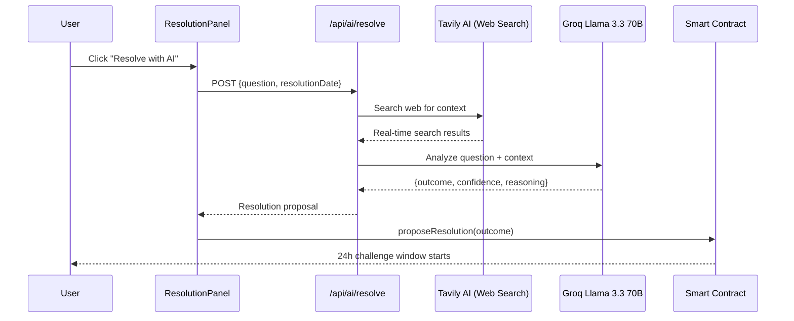
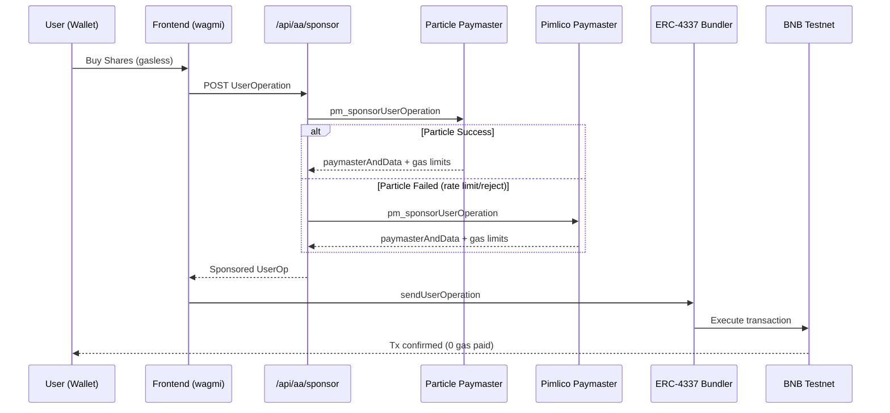

# SeerHive - AI-Powered Prediction Markets

**The first prediction market platform with AI-powered resolution and zero gas fees.**

Bet on real-world events, earn from accurate predictions, and let AI automatically resolve markets using real-time web data.

**Deployed Contract:** [0xc6Dd26D3eE0F58fAb15Dc87bEe3A66896B6D4127](https://testnet.bscscan.com/address/0xc6Dd26D3eE0F58fAb15Dc87bEe3A66896B6D4127) (BNB Testnet)

---

## 🎯 What is SeerHive?

SeerHive is a **decentralized prediction market** where you can:
- 📊 **Create markets** on any future event (sports, crypto, politics, tech)
- 💰 **Trade outcome shares** to profit from your predictions
- 🤖 **Let AI resolve** markets automatically using real-time web data
- ⚡ **Pay zero gas fees** with account abstraction (ERC-4337)
- 🏆 **Build reputation** and earn from accurate predictions

### Example Markets
- "Will BNB price reach $1000 by end of 2025?"
- "Will Ethereum ETF approval happen in Q1 2025?"
- "Will Trump win 2024 US Presidential Election?"
- "Will Bitcoin halving occur before May 2024?"

---

## 🚀 Why SeerHive?

### Problems We Solve

#### For Crypto Newbies 👶
- ❌ **Problem**: Gas fees are confusing and expensive
- ✅ **Solution**: **Zero gas fees** - Trade without paying transaction costs

- ❌ **Problem**: Don't know how to use crypto wallets
- ✅ **Solution**: **Social login** via Particle Network (Google, Twitter, Email)

- ❌ **Problem**: Prediction markets are complicated
- ✅ **Solution**: **Simple UI** - Just pick YES or NO, like betting on sports

#### For Experienced Users 🧠
- ❌ **Problem**: Manual market resolution is slow and biased (UMA OO takes 24-48h)
- ✅ **Solution**: **AI + Web Scraping** - Automated resolution in seconds with real-time data

- ❌ **Problem**: Prediction markets feel like complex DeFi dApps
- ✅ **Solution**: **Account Abstraction** - Gasless UX that feels like normal apps

- ❌ **Problem**: Centralized oracles can be manipulated in low-liquidity markets
- ✅ **Solution**: **Optimistic resolution** - 24h challenge window + DAO disputes

### Competitive Advantages

| Feature | SeerHive | Polymarket | Traditional Betting |
|---------|----------|------------|---------------------|
| **AI Resolution** | ✅ Yes (seconds) | ❌ Manual (24-48h) | ❌ Centralized |
| **Zero Gas Fees** | ✅ Yes (ERC-4337) | ❌ No | N/A |
| **Real-time Data** | ✅ Web Scraping | ❌ No | ✅ Yes |
| **Decentralized** | ✅ Yes | ⚠️ Partial | ❌ No |
| **Social Login** | ✅ Yes | ❌ No | ✅ Yes |
| **BNB Chain Native** | ✅ Yes | ❌ Polygon | N/A |

---

## 🔄 How It Works

### 1️⃣ Create a Market
```
User → "Will Bitcoin reach $100k by Dec 2025?"
     → Set end date: 2025-12-31
     → Deploy market (gasless)
```

### 2️⃣ Trade Outcome Shares
```
Buyer → Buy YES shares with BNB or stablecoins
      → If outcome is YES, claim proportional payout from total pool
      → If outcome is NO, lose stake
      → Supports: BNB, tBUSD, tUSDT, tUSDC, tDAI, tBTC
```

### 3️⃣ AI Resolves Market
```
Market expires → AI searches web via Tavily
              → "Bitcoin price on Dec 31, 2025: $95,000"
              → AI determines: NO (didn't reach $100k)
              → Proposes resolution on-chain
```

### 4️⃣ Challenge Window
```
24 hours → Anyone can dispute if AI is wrong
         → Requires dispute bond
         → DAO votes on disputes
```

### 5️⃣ Payout
```
No disputes → Market finalizes
            → NO holders claim winnings
            → YES holders lose stake
```

---

---

## 🏆 Seedify x BNB Chain Hackathon

**SeerHive is competing in the YZi Labs Preferred Projects track**, addressing key challenges:

### Problems We Solve (YZi Labs Focus Areas)

1. **⚡ Slow Oracle Resolution**
   - UMA's Optimistic Oracle takes 24-48h
   - **Our Solution**: AI-assisted oracle resolves in seconds using real-time web data

2. **🎯 Account Abstraction for Better UX**
   - Prediction markets feel like complex DeFi dApps
   - **Our Solution**: Gasless transactions via ERC-4337 make it feel like normal apps

3. **🔍 Oracle Vulnerability in Low-Liquidity Markets**
   - UMA OO can be manipulated when attention is low
   - **Our Solution**: AI + 24h challenge window + DAO dispute resolution

4. **🌐 Limited Market Coverage**
   - Polymarket only covers well-defined, publicly verifiable events
   - **Our Solution**: AI can handle subjective and multi-stage predictions

### Why BNB Chain?

- ✅ **Low transaction costs** - Ideal for high-frequency prediction markets
- ✅ **ERC-4337 support** - Native account abstraction infrastructure
- ✅ **Fast finality** - Quick market resolution and payouts
- ✅ **Growing ecosystem** - Integration with BNB DeFi protocols

---

## 🛣️ Roadmap

### ✅ Phase 1: MVP (Completed)
- [x] Smart contracts on BNB Testnet with ERC20 token support
- [x] Gasless transactions (ERC-4337) with Particle + Pimlico fallback
- [x] AI resolution (Groq Llama 3.3 70B + Tavily web search)
- [x] Real-time web scraping for current events
- [x] Multi-token support (BNB, tBUSD, tUSDT, tUSDC, tDAI, tBTC)
- [x] Gasless transactions for ERC20 tokens (BNB requires gas)
- [x] Trading UI with token selection
- [x] Demo mode for wallet-free testing
- [x] Optimistic resolution with 24h challenge window (contract level)

### 🚧 Phase 2: Beta (Q1 2025)
- [ ] **BNB Mainnet deployment** with mainnet tokens (BUSD, USDT, USDC, BNB)
- [ ] **UMA Optimistic Oracle** integration for dispute resolution
- [ ] **Challenge/dispute UI** - Frontend for 24h challenge window
- [ ] **Copy trading** - Follow top predictors
- [ ] **Reputation system** - Brier scores, ELO ratings
- [ ] **Mobile PWA** with Particle social login
- [ ] **Improved payout mechanism** - Multi-token pool management

### 🔮 Phase 3: Scale (Q2 2025)
- [ ] **Advanced AI** - Multiple data sources (Twitter, Reddit, News APIs)
- [ ] **Autonomous dispute bots** - Detect manipulation automatically
- [ ] **Cross-protocol incentive layers** - Reward honest disputes
- [ ] **DAO governance** - Community-driven platform decisions
- [ ] **Liquidity aggregation** - AMM-style pools for capital efficiency
- [ ] **Developer API** - Build on top of SeerHive

### 🌟 Phase 4: Ecosystem (Q3-Q4 2025)
- [ ] **Multi-chain expansion** (opBNB, Ethereum L2s)
- [ ] **Prediction market SDK** - White-label solution for other projects
- [ ] **AI prediction agents** - Autonomous trading bots
- [ ] **Market aggregation** - Trade on Polymarket/Limitless via SeerHive
- [ ] **Institutional features** - KYC, compliance, reporting
- [ ] **Gamification** - Achievements, leaderboards, NFT badges

---

## ⚡ Quick Start (≤10 minutes)

```bash
# 1. Clone and install
git clone https://github.com/abeachmad/seerhive.git
cd seerhive
pnpm install

# 2. Configure environment
cp apps/web/.env.example apps/web/.env.local
# Add your Particle/Pimlico keys (or use demo mode)

# 3. Start development
pnpm dev
# Open http://localhost:3000

# 4. Test gasless transaction
# - Connect wallet (MetaMask on BNB Testnet)
# - Go to /markets → Create Market or Trade
# - Enable "Use Gasless Transaction" toggle
# - Submit → Check console for "Gasless sponsored: particle"
# - Verify tx on BSCScan (no gas paid by user)

# 5. Test paymaster API
./scripts/test-sponsor.sh
```

**Demo Mode (No Wallet):** Set `NEXT_PUBLIC_DEMO=1` in `.env.local` to test all features with mock data.

## 📋 Available Scripts

```bash
pnpm dev              # Start Next.js dev server
pnpm build            # Build all packages
pnpm test             # Run all tests
pnpm lint             # Lint code

# Testing
./scripts/test-sponsor.sh     # Test paymaster API
./scripts/test-ai-resolve.sh  # Test AI resolution API
./scripts/smoke-gasless.sh    # Test gasless flow

# Contracts
cd contracts
pnpm test             # Test smart contracts
pnpm deploy:testnet   # Deploy to BNB Testnet
```

## 🤖 AI-Powered Market Resolution

SeerHive uses **AI + Web Scraping** to automatically resolve prediction markets with real-time data.

### Architecture



### Key Features

- **Real-time web search**: Tavily AI fetches current events and news
- **Advanced reasoning**: Groq Llama 3.3 70B analyzes context and determines outcome
- **Structured output**: JSON with outcome (YES/NO/INVALID), confidence (0-100), reasoning
- **Fallback models**: Llama 3.3 70B → Llama 3.1 8B for reliability
- **Free tier**: 1000 searches/month (Tavily) + 30 req/min (Groq)

### How It Works

1. User clicks "Resolve with AI" on expired market
2. Tavily searches web for real-time context about the question
3. Groq Llama 3.3 70B analyzes question + web context
4. AI returns structured decision with confidence score
5. Proposal submitted on-chain with 24-hour challenge window
6. If no disputes, market auto-finalizes

### AI Resolution API Example

**Endpoint:** `POST /api/ai/resolve`

**Request:**
```json
{
  "marketId": 1,
  "question": "Did Bitcoin reach $100,000 in 2024?",
  "resolutionDate": "2024-12-31"
}
```

**Response:**
```json
{
  "marketId": 1,
  "outcome": "NO",
  "confidence": 100,
  "reasoning": "Historical data shows Bitcoin did not reach $100,000 in 2024",
  "latency_ms": 1772
}
```

**Test:**
```bash
./scripts/test-ai-resolve.sh
```

### Competitive Advantage

| Platform | Resolution Method | Real-time Data |
|----------|------------------|----------------|
| **SeerHive** | AI + Web Scraping | ✅ Yes |
| Predifi | Aggregation only | ❌ No resolution |
| Kaido | Manual/Simple oracle | ❌ No |
| Masang | Not mentioned | ❌ No |

---

## ⚡ Gasless Transactions (ERC-4337)

SeerHive implements Account Abstraction with **Particle Network** as primary paymaster and **Pimlico** as fallback.

### Architecture



### Key Features

- **Server-side only**: All paymaster keys secured in Next.js API routes
- **Automatic fallback**: Particle → Pimlico on rejection/rate-limit
- **Zero frontend exposure**: No credentials in browser/client code
- **Configurable**: EntryPoint and ChainID via environment variables

### How It Works

1. Frontend calls `gaslessService.buySharesGasless()` or `createMarketGasless()`
2. Service constructs UserOperation and sends to `/api/aa/sponsor`
3. Backend tries Particle paymaster with auth headers
4. On failure, automatically falls back to Pimlico
5. Returns `paymasterAndData` + gas limits to frontend
6. Frontend submits sponsored transaction to bundler

### Sponsor API Example

**Endpoint:** `POST /api/aa/sponsor`

**Request:**
```json
{
  "userOp": {
    "sender": "0xc6Dd26D3eE0F58fAb15Dc87bEe3A66896B6D4127",
    "callData": "0x..."
  },
  "entryPoint": "0x5FF137D4b0FDCD49DcA30c7CF57E578a026d2789",
  "chainId": 97
}
```

**Response (Success):**
```json
{
  "paymasterAndData": "0x...",
  "preVerificationGas": "50000",
  "verificationGasLimit": "100000",
  "callGasLimit": "200000",
  "provider": "particle",
  "latency_ms": 234
}
```

**Response (Fallback):**
```json
{
  "paymasterAndData": "0x...",
  "provider": "pimlico",
  "latency_ms": 456,
  "fallback": true
}
```

**Test:**
```bash
# Test paymaster API endpoint
./scripts/test-sponsor.sh

# Full gasless transaction flow
./scripts/smoke-gasless.sh
```

## 🧪 Testing

**Demo Mode (No Wallet Required):**
```bash
# Set NEXT_PUBLIC_DEMO=1 in .env.local
pnpm dev
# Visit http://localhost:3000
# All features work with mock data
```

**On-Chain Mode (BNB Testnet):**
```bash
# Set NEXT_PUBLIC_DEMO=0 in .env.local
# Configure paymaster keys
pnpm dev
# Connect wallet and test gasless transactions
```

**Smart Contracts:**
```bash
cd contracts
pnpm test
pnpm deploy:testnet
```

## 📸 Screenshots

### Dashboard

*Real-time analytics with volume, markets, and agent performance*

### Markets

*Browse and trade on prediction markets with live odds*

### Gasless Trading

*Zero gas fees with Particle Network sponsorship*

### Governance

*Community-driven proposals and voting*

> **Note:** Screenshots will be added after UI polish. Run `pnpm dev` to see live demo.

## 📁 Project Structure

```
seerhive/
├── apps/
│   └── web/                    # Next.js frontend
│       ├── src/
│       │   ├── app/            # Pages and API routes
│       │   │   └── api/aa/sponsor/  # Paymaster API
│       │   ├── components/     # React components
│       │   ├── lib/            # Utilities
│       │   │   ├── gasless.ts  # Gasless service
│       │   │   ├── contracts.ts # Contract ABI
│       │   │   └── paymaster/  # Paymaster adapters
│       │   └── mocks/          # Demo data
│       └── .env.local          # Environment config
├── contracts/                  # Smart contracts
│   ├── contracts/
│   │   └── PredictionMarket.sol
│   ├── scripts/deploy.ts
│   └── test/
├── scripts/                    # Test scripts
│   ├── test-sponsor.sh
│   └── smoke-gasless.sh
└── docs/                       # Documentation
```

## 📚 Documentation

- [Build Submission](docs/BUILD_SUBMISSION.md)
- [Deployment Guide](DEPLOYMENT_GUIDE.md)
- [Build Log](LOG_SEERHIVE.md)

## 🔧 Environment Configuration

Copy `apps/web/.env.example` to `apps/web/.env.local` and configure:

### Required Variables

```bash
# Mode
NEXT_PUBLIC_DEMO=0                    # 0=on-chain, 1=demo mode

# Network (BNB Testnet)
NEXT_PUBLIC_CHAIN=bscTestnet
NEXT_PUBLIC_CHAIN_ID=97
NEXT_PUBLIC_RPC_URL=https://bsc-testnet.publicnode.com

# Smart Contract
NEXT_PUBLIC_CONTRACT_ADDRESS=0xYourDeployedContractAddress
NEXT_PUBLIC_ENTRY_POINT=0x5FF137D4b0FDCD49DcA30c7CF57E578a026d2789

# WalletConnect (optional)
NEXT_PUBLIC_WC_PROJECT_ID=your_walletconnect_project_id
```

### Paymaster Configuration (Server-side Only)

```bash
# Particle Network (Primary)
PARTICLE_PAYMASTER_URL=https://paymaster.particle.network/chain/97
PARTICLE_PROJECT_ID=your_project_id
PARTICLE_CLIENT_KEY=your_client_key

# Pimlico (Fallback)
PIMLICO_URL=https://api.pimlico.io/v2/97/rpc?apikey=YOUR_API_KEY
```

### AI Resolution Configuration (Server-side Only)

```bash
# Groq AI (LLM) - Get free key at https://console.groq.com
GROQ_API_KEY=gsk_your_groq_key_here

# Tavily AI (Web Search) - Get free key at https://tavily.com
TAVILY_API_KEY=tvly-your_tavily_key_here
```

### Deployment (contracts/.env)

```bash
PRIVATE_KEY=your_deployer_private_key
BSC_TESTNET_RPC=https://bsc-testnet.publicnode.com
```

**Security Notes:**
- Never commit `.env.local` or `.env` files
- Paymaster keys are server-side only (no `NEXT_PUBLIC_` prefix)
- Use separate keys for testnet and mainnet
- Rate limiting handled by paymaster providers
- Automatic fallback prevents service disruption

### Known Limitations & Roadmap

**Current Limitations:**
- AI resolution limited by LLM training data cutoff (use web search for recent events)
- Single contract deployment (multi-market factory planned)
- Testnet only (mainnet deployment pending audit)

**Roadmap:**
- [x] AI-powered resolution with web scraping (Groq + Tavily)
- [ ] UMA Optimistic Oracle integration for dispute resolution
- [ ] Multi-signature governance for critical operations
- [ ] Cross-chain deployment (Ethereum, Polygon)
- [ ] Mobile app with Particle social login
- [ ] Enhanced AI with multiple data sources (Twitter, Reddit, News APIs)

## 🌐 Features & Pages

- **`/`** - Homepage with hero and features
- **`/dashboard`** - Analytics dashboard (volume, markets, agents)
- **`/markets`** - Browse and trade prediction markets
- **`/events`** - Upcoming events and markets
- **`/copytrading`** - Follow top traders
- **`/governance`** - DAO proposals and voting

### Key Features

- ✅ **Gasless transactions** (ERC-4337) - Zero gas fees for users
- ✅ **Dual paymaster** - Particle (primary) + Pimlico (fallback)
- ✅ **AI-powered resolution** - Groq Llama 3.3 70B + Tavily web search
- ✅ **Real-time web scraping** - Resolves current events with live data
- ✅ **Copy trading** - Follow top traders
- ✅ **Reputation system** - Brier score, ELO, accuracy tracking
- ✅ **Optimistic resolution** - 24h challenge window
- ✅ **Demo mode** - No wallet required for testing
- ✅ **BNB Chain native** - Deployed on BNB Testnet

### Why BNB Chain?

- **Low gas costs** - Ideal for high-frequency prediction markets
- **ERC-4337 support** - Native account abstraction infrastructure
- **Fast finality** - Quick market resolution and payouts
- **Growing DeFi ecosystem** - Integration with BNB DeFi protocols

## 🏗️ Tech Stack

**Frontend:**
- Next.js 14 (App Router)
- TypeScript
- Tailwind CSS + shadcn/ui
- wagmi + viem (Ethereum interactions)
- Zustand (State management)
- Recharts (Analytics)

**Smart Contracts:**
- Solidity 0.8.x
- Hardhat
- OpenZeppelin
- Deployed on BNB Testnet (Chain ID: 97)

**Account Abstraction (ERC-4337):**
- Particle Network Paymaster (Primary)
- Pimlico Paymaster (Fallback)
- EntryPoint v0.6.0

**AI Resolution:**
- Groq Llama 3.3 70B (Reasoning)
- Tavily AI (Web Search)
- Real-time data fetching

**Infrastructure:**
- Turborepo (Monorepo)
- pnpm (Package manager)
- GitHub Actions (CI/CD)

## 📄 License

MIT

---

Built for BNB Chain • Inspired by Verisight & ZeroToll
