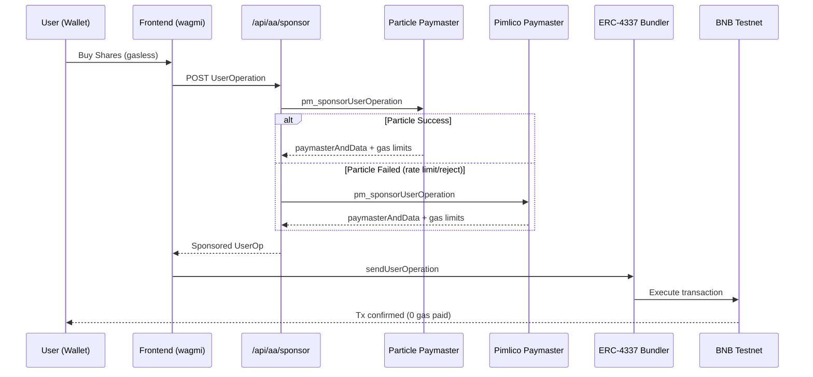

# SeerHive - Social Prediction Markets

AI-assisted prediction markets on BNB Chain with **gasless transactions** (ERC-4337), copy trading, and governance.

**Deployed Contract:** [0xc6Dd26D3eE0F58fAb15Dc87bEe3A66896B6D4127](https://testnet.bscscan.com/address/0xc6Dd26D3eE0F58fAb15Dc87bEe3A66896B6D4127) (BNB Testnet)

## 👨⚖️ Judge Quick Start (≤10 minutes)

```bash
# 1. Clone and install
git clone https://github.com/abeachmad/seerhive.git
cd seerhive
pnpm install

# 2. Configure environment
cp apps/web/.env.example apps/web/.env.local
# Add your Particle/Pimlico keys (or use demo mode)

# 3. Start development
pnpm dev
# Open http://localhost:3000

# 4. Test gasless transaction
# - Connect wallet (MetaMask on BNB Testnet)
# - Go to /markets → Create Market or Trade
# - Enable "Use Gasless Transaction" toggle
# - Submit → Check console for "Gasless sponsored: particle"
# - Verify tx on BSCScan (no gas paid by user)

# 5. Test paymaster API
./scripts/test-sponsor.sh
```

**Demo Mode (No Wallet):** Set `NEXT_PUBLIC_DEMO=1` in `.env.local` to test all features with mock data.

## 📋 Available Scripts

```bash
pnpm dev              # Start Next.js dev server
pnpm build            # Build all packages
pnpm test             # Run all tests
pnpm lint             # Lint code

# Testing
./scripts/test-sponsor.sh   # Test paymaster API
./scripts/smoke-gasless.sh  # Test gasless flow

# Contracts
cd contracts
pnpm test             # Test smart contracts
pnpm deploy:testnet   # Deploy to BNB Testnet
```

## ⚡ Gasless Transactions (ERC-4337)

SeerHive implements Account Abstraction with **Particle Network** as primary paymaster and **Pimlico** as fallback.

### Architecture



### Key Features

- **Server-side only**: All paymaster keys secured in Next.js API routes
- **Automatic fallback**: Particle → Pimlico on rejection/rate-limit
- **Zero frontend exposure**: No credentials in browser/client code
- **Configurable**: EntryPoint and ChainID via environment variables

### How It Works

1. Frontend calls `gaslessService.buySharesGasless()` or `createMarketGasless()`
2. Service constructs UserOperation and sends to `/api/aa/sponsor`
3. Backend tries Particle paymaster with auth headers
4. On failure, automatically falls back to Pimlico
5. Returns `paymasterAndData` + gas limits to frontend
6. Frontend submits sponsored transaction to bundler

### Sponsor API Example

**Endpoint:** `POST /api/aa/sponsor`

**Request:**
```json
{
  "userOp": {
    "sender": "0xc6Dd26D3eE0F58fAb15Dc87bEe3A66896B6D4127",
    "callData": "0x..."
  },
  "entryPoint": "0x5FF137D4b0FDCD49DcA30c7CF57E578a026d2789",
  "chainId": 97
}
```

**Response (Success):**
```json
{
  "paymasterAndData": "0x...",
  "preVerificationGas": "50000",
  "verificationGasLimit": "100000",
  "callGasLimit": "200000",
  "provider": "particle",
  "latency_ms": 234
}
```

**Response (Fallback):**
```json
{
  "paymasterAndData": "0x...",
  "provider": "pimlico",
  "latency_ms": 456,
  "fallback": true
}
```

**Test:**
```bash
# Test paymaster API endpoint
./scripts/test-sponsor.sh

# Full gasless transaction flow
./scripts/smoke-gasless.sh
```

## 🧪 Testing

**Demo Mode (No Wallet Required):**
```bash
# Set NEXT_PUBLIC_DEMO=1 in .env.local
pnpm dev
# Visit http://localhost:3000
# All features work with mock data
```

**On-Chain Mode (BNB Testnet):**
```bash
# Set NEXT_PUBLIC_DEMO=0 in .env.local
# Configure paymaster keys
pnpm dev
# Connect wallet and test gasless transactions
```

**Smart Contracts:**
```bash
cd contracts
pnpm test
pnpm deploy:testnet
```

## 📸 Screenshots

### Dashboard

*Real-time analytics with volume, markets, and agent performance*

### Markets

*Browse and trade on prediction markets with live odds*

### Gasless Trading

*Zero gas fees with Particle Network sponsorship*

### Governance

*Community-driven proposals and voting*

> **Note:** Screenshots will be added after UI polish. Run `pnpm dev` to see live demo.

## 📁 Project Structure

```
seerhive/
├── apps/
│   └── web/                    # Next.js frontend
│       ├── src/
│       │   ├── app/            # Pages and API routes
│       │   │   └── api/aa/sponsor/  # Paymaster API
│       │   ├── components/     # React components
│       │   ├── lib/            # Utilities
│       │   │   ├── gasless.ts  # Gasless service
│       │   │   ├── contracts.ts # Contract ABI
│       │   │   └── paymaster/  # Paymaster adapters
│       │   └── mocks/          # Demo data
│       └── .env.local          # Environment config
├── contracts/                  # Smart contracts
│   ├── contracts/
│   │   └── PredictionMarket.sol
│   ├── scripts/deploy.ts
│   └── test/
├── scripts/                    # Test scripts
│   ├── test-sponsor.sh
│   └── smoke-gasless.sh
└── docs/                       # Documentation
```

## 📚 Documentation

- [Build Submission](docs/BUILD_SUBMISSION.md)
- [Deployment Guide](DEPLOYMENT_GUIDE.md)
- [Build Log](LOG_SEERHIVE.md)

## 🔧 Environment Configuration

Copy `apps/web/.env.example` to `apps/web/.env.local` and configure:

### Required Variables

```bash
# Mode
NEXT_PUBLIC_DEMO=0                    # 0=on-chain, 1=demo mode

# Network (BNB Testnet)
NEXT_PUBLIC_CHAIN=bscTestnet
NEXT_PUBLIC_CHAIN_ID=97
NEXT_PUBLIC_RPC_URL=https://bsc-testnet.publicnode.com

# Smart Contract
NEXT_PUBLIC_CONTRACT_ADDRESS=0xYourDeployedContractAddress
NEXT_PUBLIC_ENTRY_POINT=0x5FF137D4b0FDCD49DcA30c7CF57E578a026d2789

# WalletConnect (optional)
NEXT_PUBLIC_WC_PROJECT_ID=your_walletconnect_project_id
```

### Paymaster Configuration (Server-side Only)

```bash
# Particle Network (Primary)
PARTICLE_PAYMASTER_URL=https://paymaster.particle.network/chain/97
PARTICLE_PROJECT_ID=your_project_id
PARTICLE_CLIENT_KEY=your_client_key

# Pimlico (Fallback)
PIMLICO_URL=https://api.pimlico.io/v2/97/rpc?apikey=YOUR_API_KEY
```

### Deployment (contracts/.env)

```bash
PRIVATE_KEY=your_deployer_private_key
BSC_TESTNET_RPC=https://bsc-testnet.publicnode.com
```

**Security Notes:**
- Never commit `.env.local` or `.env` files
- Paymaster keys are server-side only (no `NEXT_PUBLIC_` prefix)
- Use separate keys for testnet and mainnet
- Rate limiting handled by paymaster providers
- Automatic fallback prevents service disruption

### Known Limitations & Roadmap

**Current Limitations:**
- Subjective markets require manual resolution (AI oracle in progress)
- Single contract deployment (multi-market factory planned)
- Testnet only (mainnet deployment pending audit)

**Roadmap:**
- [ ] UMA Optimistic Oracle integration for dispute resolution
- [ ] Multi-signature governance for critical operations
- [ ] Cross-chain deployment (Ethereum, Polygon)
- [ ] Mobile app with Particle social login

## 🌐 Features & Pages

- **`/`** - Homepage with hero and features
- **`/dashboard`** - Analytics dashboard (volume, markets, agents)
- **`/markets`** - Browse and trade prediction markets
- **`/events`** - Upcoming events and markets
- **`/copytrading`** - Follow top traders
- **`/governance`** - DAO proposals and voting

### Key Features

- ✅ **Gasless transactions** (ERC-4337) - Zero gas fees for users
- ✅ **Dual paymaster** - Particle (primary) + Pimlico (fallback)
- ✅ **AI-powered resolution** - Automated market settlement
- ✅ **Copy trading** - Follow top traders
- ✅ **Reputation system** - Brier score, ELO, accuracy tracking
- ✅ **Optimistic resolution** - 24h challenge window
- ✅ **Demo mode** - No wallet required for testing
- ✅ **BNB Chain native** - Deployed on BNB Testnet

### Why BNB Chain?

- **Low gas costs** - Ideal for high-frequency prediction markets
- **ERC-4337 support** - Native account abstraction infrastructure
- **Fast finality** - Quick market resolution and payouts
- **Growing DeFi ecosystem** - Integration with BNB DeFi protocols

## 🏗️ Tech Stack

**Frontend:**
- Next.js 14 (App Router)
- TypeScript
- Tailwind CSS + shadcn/ui
- wagmi + viem (Ethereum interactions)
- Zustand (State management)
- Recharts (Analytics)

**Smart Contracts:**
- Solidity 0.8.x
- Hardhat
- OpenZeppelin
- Deployed on BNB Testnet (Chain ID: 97)

**Account Abstraction (ERC-4337):**
- Particle Network Paymaster (Primary)
- Pimlico Paymaster (Fallback)
- EntryPoint v0.6.0

**Infrastructure:**
- Turborepo (Monorepo)
- pnpm (Package manager)
- GitHub Actions (CI/CD)

## 📄 License

MIT

---

Built for BNB Chain • Inspired by Verisight & ZeroToll
