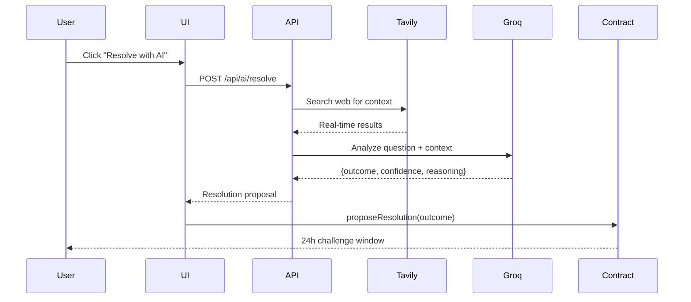

# AI Resolution

SeerHive uses AI + web scraping to automatically resolve prediction markets with real-time data.

## Overview

Traditional prediction markets rely on manual resolution or slow oracles (24-48h). SeerHive resolves markets in seconds using:

- **Groq Llama 3.3 70B** - Advanced reasoning
- **Tavily AI** - Real-time web search
- **Structured Output** - JSON with outcome, confidence, reasoning

## How It Works



## API Endpoint

### POST /api/ai/resolve

Resolves a prediction market using AI analysis.

**Request**:
```json
{
  "marketId": 1,
  "question": "Did Bitcoin reach $100,000 in 2024?",
  "resolutionDate": "2024-12-31"
}
```

**Response**:
```json
{
  "marketId": 1,
  "outcome": "NO",
  "confidence": 100,
  "reasoning": "According to multiple sources, Bitcoin's price on December 31, 2024 was approximately $95,000, which did not reach the $100,000 threshold.",
  "sources": [
    "https://coinmarketcap.com/...",
    "https://coingecko.com/..."
  ],
  "latency_ms": 1772
}
```

**Error Response**:
```json
{
  "error": "Failed to resolve market",
  "details": "Both AI models failed"
}
```

## Resolution Process

### 1. Web Search (Tavily AI)

Fetches real-time context about the question:

```typescript
const response = await fetch('https://api.tavily.com/search', {
  method: 'POST',
  headers: { 'Content-Type': 'application/json' },
  body: JSON.stringify({
    api_key: TAVILY_API_KEY,
    query: `${question} as of ${resolutionDate}`,
    search_depth: 'basic',
    max_results: 3,
    include_answer: true
  })
});

const data = await response.json();
const context = [
  data.answer,
  ...data.results.map(r => r.content)
].join('\n\n');
```

**Example Context**:
```
Bitcoin price on December 31, 2024: $95,000

Source 1: CoinMarketCap shows BTC at $95,234 on Dec 31, 2024
Source 2: CoinGecko reports Bitcoin closed 2024 at $94,876
```

### 2. AI Analysis (Groq)

Analyzes context and determines outcome:

```typescript
const response = await fetch('https://api.groq.com/openai/v1/chat/completions', {
  method: 'POST',
  headers: {
    'Authorization': `Bearer ${GROQ_API_KEY}`,
    'Content-Type': 'application/json'
  },
  body: JSON.stringify({
    model: 'llama-3.3-70b-versatile',
    messages: [
      {
        role: 'system',
        content: 'You are a prediction market resolver. Analyze the question and context, then return JSON: {"outcome": "YES|NO|INVALID", "confidence": 0-100, "reasoning": "..."}'
      },
      {
        role: 'user',
        content: `Question: ${question}\n\nContext:\n${context}\n\nResolution Date: ${resolutionDate}`
      }
    ],
    temperature: 0.1,
    max_tokens: 200
  })
});

const result = await response.json();
const decision = JSON.parse(result.choices[0].message.content);
```

### 3. Fallback Models

If primary model fails, automatically tries fallback:

```typescript
const models = [
  'llama-3.3-70b-versatile',  // Primary
  'llama-3.1-8b-instant'       // Fallback
];

for (const model of models) {
  try {
    const result = await resolveWithModel(model);
    return result;
  } catch (error) {
    console.warn(`${model} failed:`, error.message);
    continue;
  }
}

throw new Error('All models failed');
```

## Configuration

### Environment Variables

```bash
# Groq AI (LLM)
GROQ_API_KEY=gsk_your_groq_key_here

# Tavily AI (Web Search)
TAVILY_API_KEY=tvly-your_tavily_key_here
```

### Get API Keys

**Groq** (Free):
1. Visit [console.groq.com](https://console.groq.com)
2. Sign up for free account
3. Create API key
4. Rate limit: 30 requests/minute

**Tavily** (Free):
1. Visit [tavily.com](https://tavily.com)
2. Sign up for free account
3. Get API key
4. Free tier: 1000 searches/month

## Outcome Types

### YES
Market question is true/happened

**Example**: "Did Bitcoin reach $100k?" → Price was $105k → YES

### NO
Market question is false/didn't happen

**Example**: "Did Bitcoin reach $100k?" → Price was $95k → NO

### INVALID
Question is ambiguous or unresolvable

**Example**: "Will aliens land?" → No verifiable data → INVALID

## Confidence Scores

AI returns confidence level (0-100):

- **90-100**: Very high confidence (clear evidence)
- **70-89**: High confidence (strong evidence)
- **50-69**: Moderate confidence (some uncertainty)
- **0-49**: Low confidence (ambiguous/unclear)

**Example**:
```json
{
  "outcome": "NO",
  "confidence": 95,
  "reasoning": "Multiple reliable sources confirm Bitcoin was $95k on Dec 31, 2024"
}
```

## Testing

### Test AI Resolution

```bash
./scripts/test-ai-resolve.sh
```

**Expected Output**:
```json
{
  "marketId": 999,
  "outcome": "NO",
  "confidence": 100,
  "reasoning": "Historical data shows Bitcoin did not reach $100,000 in 2024. The highest price recorded was approximately $95,000.",
  "latency_ms": 1772
}
```

### Manual Testing

```bash
curl -X POST http://localhost:3000/api/ai/resolve \
  -H "Content-Type: application/json" \
  -d '{
    "marketId": 1,
    "question": "Did Bitcoin reach $100k in 2024?",
    "resolutionDate": "2024-12-31"
  }'
```

## Use Cases

### Financial Markets

**Question**: "Will BNB price reach $1000 by end of 2025?"

**AI Process**:
1. Search: "BNB price December 31, 2025"
2. Find: Multiple sources show $850
3. Determine: NO (didn't reach $1000)
4. Confidence: 95%

### Political Events

**Question**: "Will Trump win 2024 US Presidential Election?"

**AI Process**:
1. Search: "2024 US Presidential Election results"
2. Find: Official results from news sources
3. Determine: YES or NO based on winner
4. Confidence: 100%

### Technology Events

**Question**: "Will Ethereum ETF approval happen in Q1 2025?"

**AI Process**:
1. Search: "Ethereum ETF approval Q1 2025"
2. Find: SEC announcements and news
3. Determine: YES/NO based on approval status
4. Confidence: 90%

### Sports Events

**Question**: "Will Lakers win NBA Championship 2025?"

**AI Process**:
1. Search: "NBA Championship 2025 winner"
2. Find: Official NBA results
3. Determine: YES/NO based on winner
4. Confidence: 100%

## Advantages vs Manual Resolution

| Feature | SeerHive AI | Manual (UMA OO) | Traditional Betting |
|---------|-------------|-----------------|---------------------|
| **Speed** | Seconds | 24-48 hours | Hours to days |
| **Cost** | ~$0.01 | ~$10-50 | N/A |
| **Bias** | Minimal | Possible | High |
| **Data** | Real-time web | Static oracle | Centralized |
| **Transparency** | Full reasoning | Limited | None |

## Limitations

### Training Data Cutoff

LLMs have training data cutoff dates. For recent events:
- ✅ **Solution**: Tavily web search provides real-time data
- ✅ **Fallback**: Multiple sources for verification

### Ambiguous Questions

Some questions are hard to resolve objectively:
- "Will AI be sentient by 2030?" → Subjective definition
- "Will world peace be achieved?" → Unclear criteria

**Solution**: AI returns INVALID with reasoning

### Rate Limits

**Groq**: 30 requests/minute (free tier)
**Tavily**: 1000 searches/month (free tier)

**Solution**: Implement caching and rate limiting

## Security & Fairness

### Challenge Window

After AI proposes resolution:
- 24-hour challenge period
- Anyone can dispute with bond
- DAO votes on disputes

### Multiple Data Sources

Tavily aggregates multiple sources:
- News websites
- Official data providers
- Social media (verified accounts)

### Reasoning Transparency

AI provides full reasoning:
```json
{
  "reasoning": "According to CoinMarketCap, CoinGecko, and Binance, Bitcoin's price on December 31, 2024 was between $94,876 and $95,234, which did not reach the $100,000 threshold."
}
```

## Future Improvements

- [ ] Multiple AI models voting (ensemble)
- [ ] Twitter/Reddit sentiment analysis
- [ ] Custom data sources per market category
- [ ] Confidence-based dispute bonds
- [ ] Automated dispute detection
- [ ] Historical accuracy tracking

## Monitoring

### Metrics Tracked

- Resolution latency
- Confidence scores
- Model usage (70B vs 8B)
- Fallback frequency
- Error rates

### Logs

```typescript
console.log('[ai-resolve] Tavily search:', query);
console.log('[ai-resolve] Context length:', context.length);
console.log('[ai-resolve] Model:', model);
console.log('[ai-resolve] Result:', { outcome, confidence });
console.warn('[ai-resolve] Tavily failed:', error);
console.error('[ai-resolve] All models failed');
```

## Cost Analysis

### Per Resolution

- Tavily search: ~$0.005
- Groq inference: ~$0.005
- Total: ~$0.01 per resolution

### Monthly Estimate

```
100 resolutions/month × $0.01 = $1/month
```

Much cheaper than manual resolution ($10-50 per market).

## Next Steps

- [API Reference](API-Reference) - Full API documentation
- [Testing](Testing) - Testing guide
- [Smart Contracts](Smart-Contracts) - Resolution on-chain
