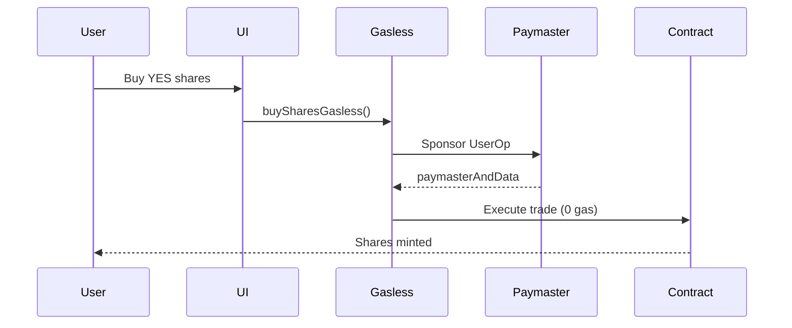
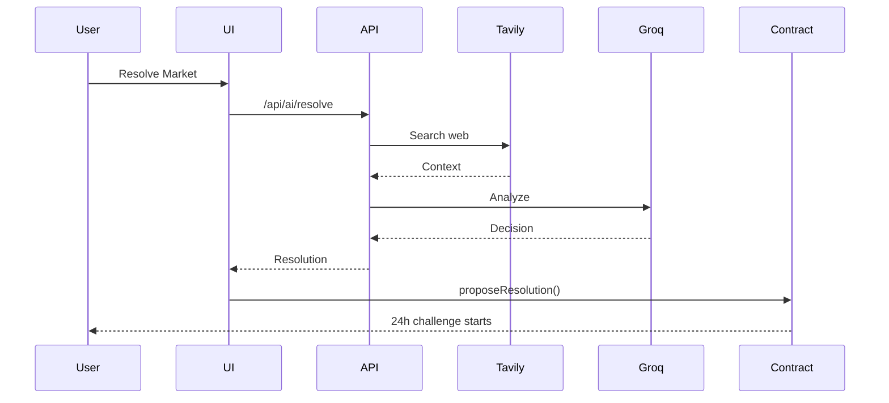

# Architecture

SeerHive's architecture combines blockchain, AI, and account abstraction for a seamless prediction market experience.

## System Overview

```
┌─────────────────────────────────────────────────────────────┐
│                         Frontend                             │
│  Next.js 14 + TypeScript + wagmi + Particle Network         │
└─────────────────┬───────────────────────────────────────────┘
                  │
        ┌─────────┴─────────┐
        │                   │
        ▼                   ▼
┌───────────────┐   ┌──────────────────┐
│  Smart        │   │  API Routes      │
│  Contracts    │   │  (Server-side)   │
│  (BNB Chain)  │   └────────┬─────────┘
└───────────────┘            │
                    ┌────────┴────────┐
                    │                 │
                    ▼                 ▼
            ┌──────────────┐  ┌─────────────┐
            │  Paymasters  │  │  AI Services│
            │  (ERC-4337)  │  │  (Groq +    │
            │              │  │   Tavily)   │
            └──────────────┘  └─────────────┘
```

## Core Components

### 1. Frontend Application

**Location**: `apps/web/`

**Tech Stack**:
- Next.js 14 (App Router)
- TypeScript
- wagmi + viem (Ethereum interactions)
- Particle Network (Social login + AA)
- Tailwind CSS + shadcn/ui

**Key Features**:
- Server and client components
- API routes for backend logic
- Component variants (Particle vs Wagmi)
- Zustand state management

### 2. Smart Contracts

**Location**: `contracts/`

**Main Contract**: `PredictionMarket.sol`

**Features**:
- Multi-token support (ERC20 + native BNB)
- Market creation and trading
- Optimistic resolution with 24h challenge window
- Share-based payout system

**Deployed Address**: `0xc6Dd26D3eE0F58fAb15Dc87bEe3A66896B6D4127`

### 3. Account Abstraction Layer

**ERC-4337 Implementation**:
- EntryPoint: `0x5FF137D4b0FDCD49DcA30c7CF57E578a026d2789`
- Dual Paymaster: Particle (primary) + Pimlico (fallback)
- Server-side sponsorship API

**Flow**:
```
User Action → Frontend → /api/aa/sponsor → Paymaster → Bundler → Chain
```

### 4. AI Resolution System

**Components**:
- Groq Llama 3.3 70B (Reasoning)
- Tavily AI (Web Search)
- Server-side API route (`/api/ai/resolve`)

**Flow**:
```
Market Expires → User Triggers → Tavily Search → Groq Analysis → On-chain Proposal
```

## Data Flow

### Trading Flow



### Resolution Flow



## Directory Structure

```
seerhive/
├── apps/web/
│   ├── src/
│   │   ├── app/              # Pages & API routes
│   │   │   ├── api/
│   │   │   │   ├── aa/sponsor/    # Paymaster API
│   │   │   │   └── ai/resolve/    # AI resolution
│   │   │   ├── markets/           # Markets page
│   │   │   └── dashboard/         # Analytics
│   │   ├── components/       # React components
│   │   │   ├── TradeDialog.tsx
│   │   │   ├── WalletButton.tsx
│   │   │   └── ui/                # shadcn/ui
│   │   ├── lib/              # Core services
│   │   │   ├── gasless.ts         # Gasless service
│   │   │   ├── contracts.ts       # Contract ABI
│   │   │   ├── aiResolver.ts      # AI service
│   │   │   └── paymaster/         # Paymaster adapters
│   │   └── types/            # TypeScript types
│   └── .env.local            # Environment config
├── contracts/
│   ├── contracts/
│   │   ├── PredictionMarket.sol
│   │   ├── MockERC20.sol
│   │   └── BUSDFaucet.sol
│   ├── scripts/              # Deployment
│   └── test/                 # Contract tests
└── scripts/                  # Testing scripts
```

## Key Design Patterns

### Component Variants

Separate implementations for different providers:

```typescript
// TradeDialog-Particle.tsx - Particle Network
export function TradeDialogParticle({ market }: Props) { }

// TradeDialog-Wagmi.tsx - Wagmi
export function TradeDialogWagmi({ market }: Props) { }

// TradeDialog.tsx - Unified interface
export function TradeDialog(props: Props) {
  return isParticle ? <TradeDialogParticle {...props} /> : <TradeDialogWagmi {...props} />;
}
```

### Paymaster Fallback

Automatic failover for reliability:

```typescript
// Try Particle first
try {
  return await particlePaymaster.sponsor(userOp);
} catch (error) {
  // Fallback to Pimlico
  return await pimlicoPaymaster.sponsor(userOp);
}
```

### Server-Side Security

All sensitive keys in API routes:

```typescript
// ❌ Client-side (exposed)
NEXT_PUBLIC_API_KEY=xxx

// ✅ Server-side (secure)
GROQ_API_KEY=xxx
PARTICLE_PROJECT_ID=xxx
```

## Network Architecture

### BNB Testnet (Chain ID: 97)

- **RPC**: https://bsc-testnet.publicnode.com
- **Explorer**: https://testnet.bscscan.com
- **Faucet**: https://testnet.bnbchain.org/faucet-smart

### Supported Tokens

| Token | Address | Type |
|-------|---------|------|
| BNB | Native | Native |
| tBUSD | 0xaB1a4d4f1D656d2450692D237fdD6C7f9146e814 | ERC20 |
| tUSDT | 0x337610d27c682E347C9cD60BD4b3b107C9d34dDd | ERC20 |
| tUSDC | 0x64544969ed7EBf5f083679233325356EbE738930 | ERC20 |
| tDAI | 0xEC5dCb5Dbf4B114C9d0F65BcCAb49EC54F6A0867 | ERC20 |
| tBTC | 0x6ce8dA28E2f864420840cF74474eFf5fD80E65B8 | ERC20 |

## Scalability Considerations

### Current Limitations
- Single contract deployment
- Testnet only
- Rate limits on AI services (30 req/min Groq, 1000/month Tavily)

### Future Improvements
- Multi-market factory pattern
- Cross-chain deployment (opBNB, Ethereum L2s)
- Enhanced AI with multiple data sources
- Liquidity aggregation (AMM-style pools)

## Security Architecture

### Smart Contract Security
- OpenZeppelin libraries
- ReentrancyGuard on critical functions
- Owner-based access control
- 24-hour challenge window

### API Security
- Server-side key management
- Rate limiting on paymaster endpoints
- Input validation on all endpoints
- Automatic fallback prevents DoS

### Frontend Security
- No private keys in client code
- Environment variable separation
- Secure wallet connection (wagmi)

## Monitoring & Observability

### Logging
```typescript
console.log('✅ Transaction:', txHash);
console.warn('[ai-resolve] Tavily failed:', error);
console.error('[api-route] Error:', error);
```

### Metrics
- Transaction latency (`latency_ms` in API responses)
- Paymaster provider usage (particle vs pimlico)
- AI resolution confidence scores

## Next Steps

- [Smart Contracts](Smart-Contracts) - Contract details
- [Gasless Transactions](Gasless-Transactions) - ERC-4337 deep dive
- [AI Resolution](AI-Resolution) - AI system details
